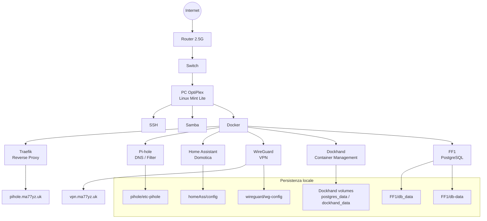

# Documentazione della struttura di casa

## Panoramica

Questa infrastruttura domestica gira su un PC OptiPlex con Linux Mint Lite, collegato via cavo Cat 7 a uno switch che a sua volta è connesso al router su una sottorete dedicata a 2.5G.

Sul PC sono presenti i servizi base:

- SSH
- Samba
- Docker

Sopra Docker sono stati organizzati i servizi principali di rete, automazione e gestione.

## Struttura logica

L'ambiente si può dividere in questi livelli:

1. Livello fisico e rete locale
2. Host Linux Mint Lite sull'OptiPlex
3. Servizi di base: SSH, Samba e Docker
4. Stack Docker: Traefik, Pi-hole, Home Assistant, WireGuard, Dockhand e un server Postgres dedicato
5. Dati persistenti, configurazioni e backup locali nelle cartelle del workspace

## Rete e collegamento

Il PC host è il nodo centrale della rete domestica. La connessione è realizzata così:

- PC OptiPlex collegato via Cat 7 allo switch
- switch collegato al router
- sottorete dedicata con link a 2.5G

Dal punto di vista operativo questo significa che il PC ospita i servizi e li espone alla LAN, mentre Traefik e WireGuard danno rispettivamente accesso web e accesso remoto sicuro.

## Servizi di base sull'host

### SSH

Usato per amministrazione remota del PC e dei servizi.

### Samba

Usato per la condivisione di file sulla rete locale.

### Docker

È il layer che ospita i servizi applicativi e di infrastruttura.

## Servizi Docker

### Traefik

File principali:

- [traefik/docker-compose.yaml](traefik/docker-compose.yaml)
- [traefik/config/traefik.yaml](traefik/config/traefik.yaml)

Ruolo:

- reverse proxy centrale
- pubblica le porte 80, 443 e 8080
- usa il Docker socket per scoprire i container
- espone solo i servizi etichettati in modo esplicito

Caratteristiche osservate:

- dashboard abilitata
- provider Docker attivo
- `exposedByDefault: false`

### Pi-hole

File principale:

- [pihole/docker-compose.yaml](pihole/docker-compose.yaml)

Ruolo:

- DNS filtering e blocco pubblicità a livello di rete
- servizio web pubblicato tramite Traefik sul nome `pihole.ma77yz.uk`

Dettagli principali:

- espone DNS su porta 53 TCP/UDP
- usa la rete `proxy`
- persistenza in [pihole/etc-pihole](pihole/etc-pihole)

### Home Assistant

File principale:

- [homeAss/docker-compose.yml](homeAss/docker-compose.yml)

Ruolo:

- automazione domotica centrale
- eseguito con `network_mode: host`
- `privileged: true` per integrazioni hardware e di rete

Persistenza e configurazione:

- [homeAss/config](homeAss/config)

Dentro `config` sono presenti file e directory di stato, log e integrazioni locali.

### WireGuard

File principale:

- [wireguard/docker-compose.yaml](wireguard/docker-compose.yaml)

Ruolo:

- accesso VPN alla rete domestica
- endpoint pubblico `vpn.ma77yz.uk`
- subnet interna `10.13.13.0`

Dettagli principali:

- porta UDP 51820
- `NET_ADMIN` e `SYS_MODULE`
- configurazione persistente in [wireguard/wg-config](wireguard/wg-config)

### Dockhand

File principale:

- [dockhand/docker-compose.yaml](dockhand/docker-compose.yaml)

Ruolo:

- interfaccia di gestione per container e stack Docker
- usa il Docker socket per interagire con Docker locale

Dettagli principali:

- applicazione sulla porta 3000
- database Postgres dedicato nello stesso compose
- persistenza con volumi nominati `postgres_data` e `dockhand_data`

### FF1

File principale:

- [FF1/docker-compose.yml](FF1/docker-compose.yml)

Ruolo:

- servizio PostgreSQL separato, con database persistente locale

Dettagli principali:

- porta host 7777 verso Postgres interno 5432
- dati persistenti in [FF1/db_data](FF1/db_data)
- presente anche [FF1/db-data](FF1/db-data) come ulteriore directory dati

## Inventario cartelle

### [dockhand](dockhand)

Contiene lo stack Docker per Dockhand e il relativo database Postgres.

### [FF1](FF1)

Contiene un PostgreSQL indipendente con storage locale dedicato.

### [homeAss](homeAss)

Contiene Home Assistant e tutta la sua configurazione persistente.

### [pihole](pihole)

Contiene Pi-hole, la sua configurazione e i backup di stato.

### [traefik](traefik)

Contiene il reverse proxy principale e la sua configurazione.

### [wireguard](wireguard)

Contiene il server VPN e le configurazioni dei peer.

### [a.txt](a.txt)

File singolo presente nella radice del workspace, non identificato come parte dello stack principale.

## Dati persistenti e backup

Queste cartelle non sono servizi, ma dati e configurazioni che vanno considerati parte dell'infrastruttura:

- [homeAss/config](homeAss/config): configurazione, log, database e integrazioni locali di Home Assistant
- [pihole/etc-pihole](pihole/etc-pihole): configurazione, database e backup di Pi-hole
- [wireguard/wg-config](wireguard/wg-config): peer, server, template e configurazioni VPN
- [FF1/db_data](FF1/db_data): dati del database PostgreSQL
- [FF1/db-data](FF1/db-data): ulteriore area dati del database

Nel caso di Home Assistant e Pi-hole sono presenti anche directory di backup e cache che servono a mantenere lo stato tra aggiornamenti e riavvii.

## Schema Mermaid

## Osservazioni finali

- Traefik è il punto centrale per l'esposizione web dei servizi.
- Home Assistant usa accesso di rete diretto, quindi non passa dal reverse proxy.
- WireGuard è il canale corretto per l'accesso remoto alla rete domestica.
- Pi-hole e i vari database mantengono uno stato persistente locale che conviene includere nei backup.

## Nota

Questa documentazione è stata costruita leggendo i file presenti nella cartella condivisa e descrive l'architettura risultante, non una configurazione ideale o astratta.